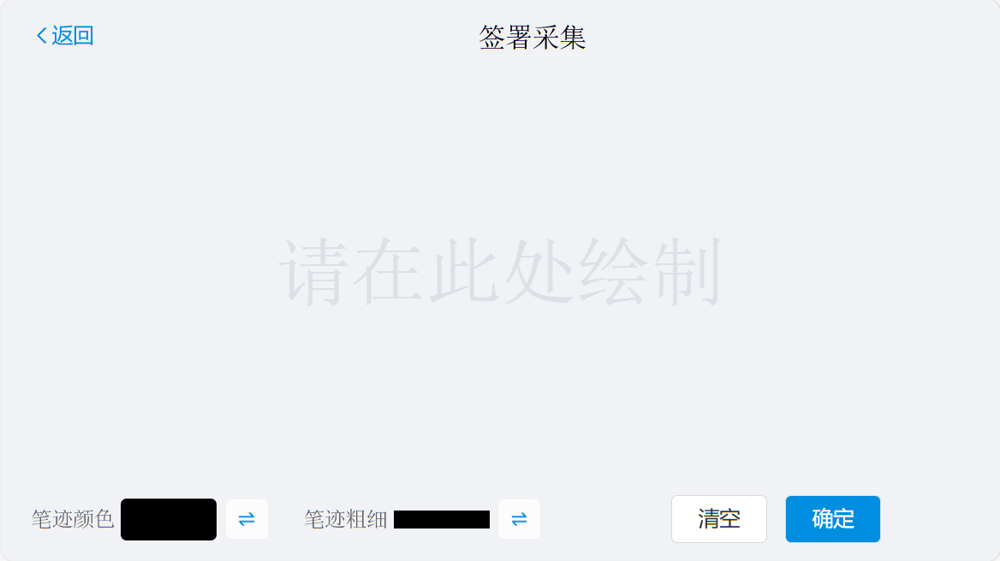

<h1 align="center">
Xs-Signature
</h1>

 <!-- <a href="docs/README.en.md">English</a> | <a href="docs/README.es.md">Spanish</a> | <a href="docs/README.de.md">German</a> | 
<a href="docs/README.fr.md">French</a> | <a href="README.md">简体中文</a> |  <a href="docs/README.ja.md">日本語</a>  -->
 <a href="README.md">简体中文</a> 

<!-- 

  
  
  

 -->

`Xs-Signature` 是一个 `Vue` 在实现移动端`手写签名`的"最佳实践"，媲美原生 `App` 丝滑流畅的使用体验。使用了最新的 `Vue` 技术栈，基于 [`Vue3`](https://cn.vuejs.org/)、[`Vite5`](https://cn.vitejs.dev/)
、[`Pinia`](https://pinia.vuejs.org/)实现。注意：目前仅支持Vue3用户使用！

<!-- ## 在线访问

Gitee Pages: [https://gitee.com/smallsun0110/tiktok](https://gitee.com/smallsun0110/tiktok)(中国地区推荐访问这个地址)    -->
## 方法

| Name                                                        | Argument Type                                           | Description                                     |
|:------------------------------------------------------------|:--------------------------------------------------------|-------------------------------------------------|
| `overlayText`                                               | `String`                                                | `自定义页面主体提示语`                                    |
| `horizontalScreenText`                                      | `String`                                                | `自定义翻转提示语`                                      |
| `title`                                                     | `String`                                                | `自定义头部标题`                                       |
| `showHeader`                                                | `Boolean`                                               | `是否展示头部`                                        |
| `showFooter`                                                | `Boolean`                                               | `是否展示底部`                                        |
| `custom`                                                    | `Boolean`                                               | `是否开启自定义模式(依旧保留头部、底部，不同于为可以自定义其中内容) 默认 'false'` |
| `close()`                                                   | `Function`                                              | `回退一步的操作`                                       |
| `reset()`                                                   | `Function`                                              | `清空页面所绘制签名操作`                                   |
| `submit(isEmpty,data,orientation)`                          | `Function`                                              | `提交获取签名Base64` `'empty':签名是否为空值、'data':签名的Base64、'orientation':屏幕翻转方向` |

## 运行
注意：本项目仅适用于彦祖学习和研究，不得其他人用于商业使用

## 功能与建议

目前项目处于开发初期，新功能正在持续添加中，如果你对该组件有任何功能与建议，欢迎联系作者。
如果你也喜欢本插件的设计思想，非常感谢你对我们的支持！

## 许可协议

MIT © [smallSun](https://github.com/smallSun0110)
